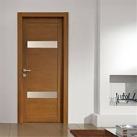

# door-detection-yolo

Door detection with yolo Deep Learning algorithm that gives a approximate boundary 
and make a exact boundary of door with felzenwalb algorithm based on giving boundary from yolo algorithm

### How to use it

  install
  
    git clone https://github.com/saeed5959/door-detection-yolo
    pip install -r requirements.txt
    
  run door detection
  
    python3 main.py --img_path ./data_test/input_img.jpg  --model_path ./yolov3.weights

### input image

### output image

