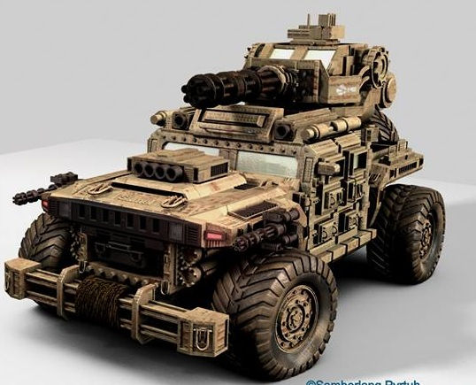
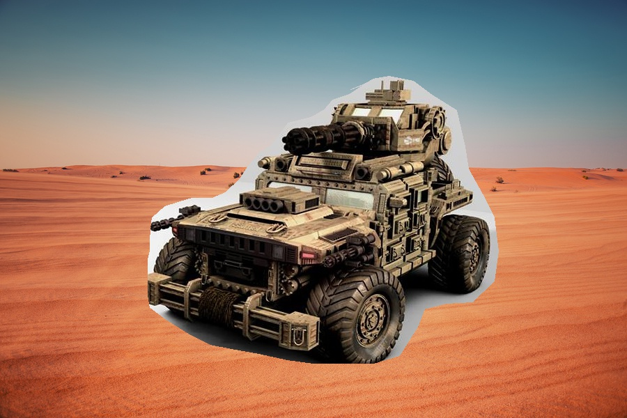
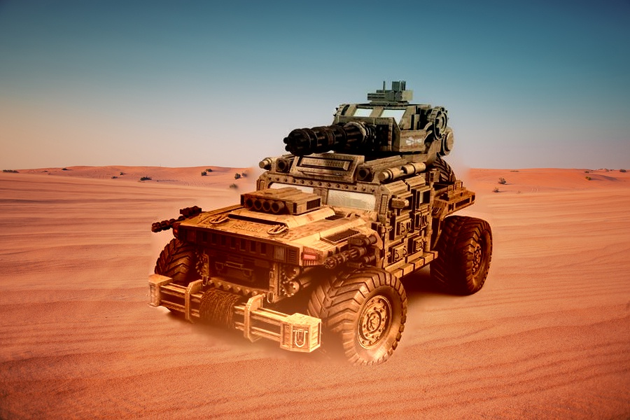

# Image blending in python

## In this project we want use a tecknique to put a image in another image while it may seem real 
 we have used poisson blending tecknique in python code
 
 ### background image
 
 
 
 
 ### a car image
 
 
 
 ### if we just crop it and put it in image it seem fake
 
 
 
 
 ### but with this way it seem real
 
 
 
